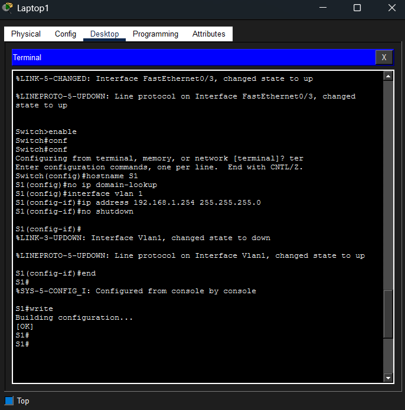
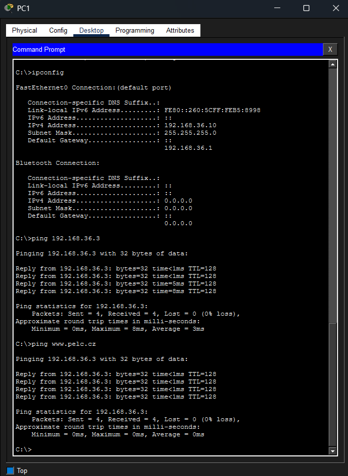
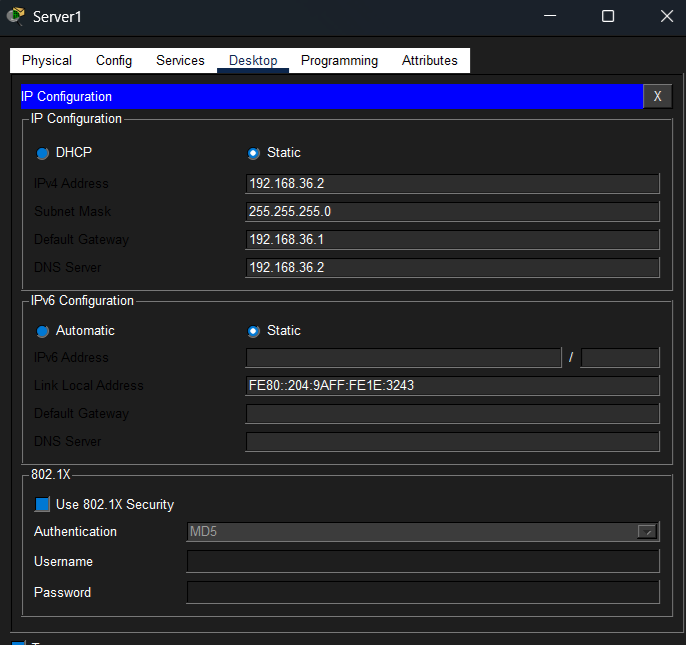
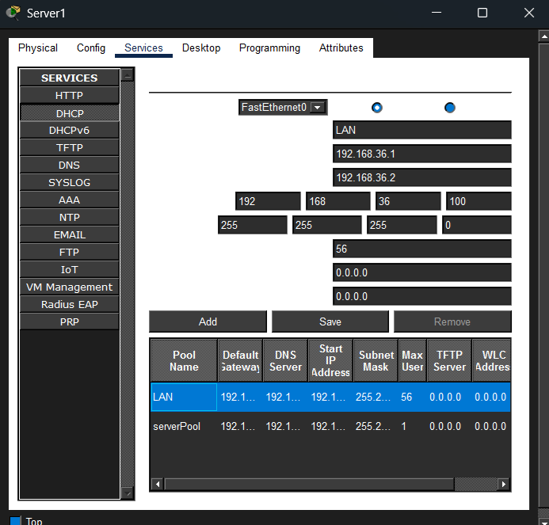
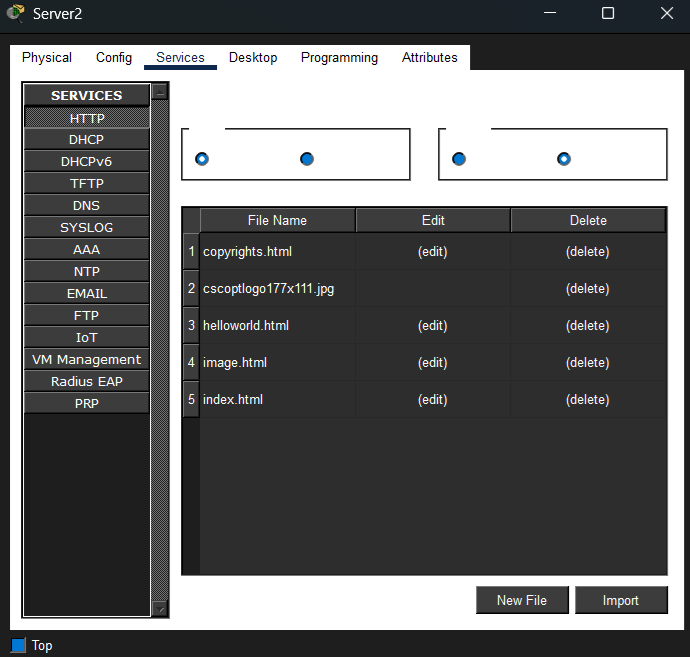
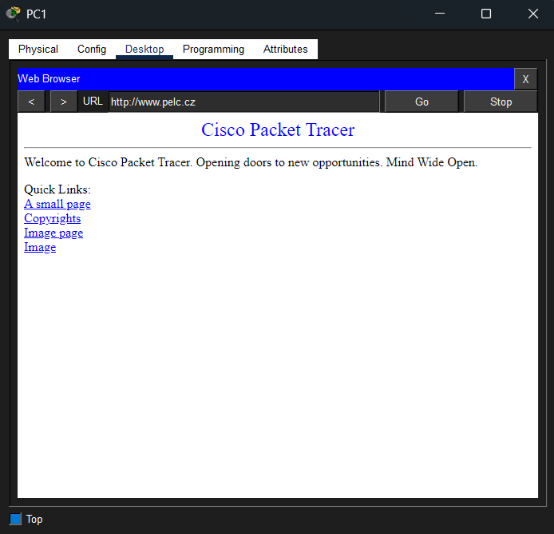

# lan.pkn
## výpočet x
x = (P = 16) + (E = 5) + (L = 12) + (C = 3) = 36
## images
### Laptop - nastavování switche

### PC1 - ipconfig a ping na SRV2 jak přes IP tak doménu.

### Nastavení DNS

### Nastavení DHCP

### Nastavení Webu

### Web přes PC1

